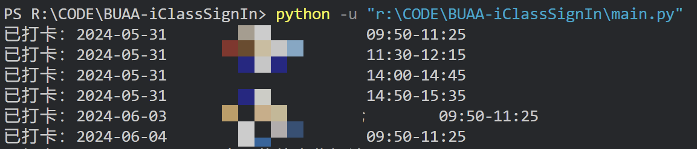

# BUAA-iClassSignIn
远程智慧教室打卡

仅作为代码学习交流用，请不要用我的代码做不好的事🥰

虽然代码逻辑写的是一次打完所有课，但建议接近上课时间再运行代码以防打卡时间太怪被判定无效

不保证能用，有一定代码能力&&想接着用的话可以阅读以下内容。

## 原理

~~众所周知~~，智慧教室扫码签到的原理是用自己登陆后的账号向签到链接（这个签到链接包含课程id和时间戳两个参数，课程id顾名思义是用来区分给哪节课签到的，时间戳则是签到二维码会不停变化的原因）发请求，请求把账号信息一起发过去从而实现签到人身份的识别

那么这个仓库的代码做了什么呢？

+ 通过`login`获取唯一确定学生身份的`userId`，在后续查询课表和签到里，这个参数用来识别用户。此外登陆会产生`sessionId`，这个被ban了我就不知道怎么办了（
+ 通过`get_stu_course_sched`查询课表，这个请求返回唯一确定一堂课的`courseSchedId`，在签到里，这个参数用来识别节次。
+ 通过`stu_scan_sign`真正进行签到。用`userId`、`courseSchedId`、`timestamp`几个参数get了一下签到请求，这一步和手机扫码的行为是一样的。

## 替代方案

听说被举报了所以要ban了，我写这个的时候其实就已经没什么课了并且马上就离开aubb了所以肯定是不会维护仓库了，简单分享两个替代方案：

1. 扫码签到的二维码其实是一个链接，想要扫描二维码就是访问这个链接。最自然的想法应该是自己复刻一个二维码出来，然后拿着app去扫描。[相关尝试](https://github.com/WinterRaurant/AUBB-signInCodeGenerator)，仓库里介绍了如何通过其他手段获取要打卡的课程id，我个人感觉这个一时半会是不会ban的。
2. 手机浏览器登录之后抓一下`sessionid`填进后续代码里。~~但是我个人感觉都开手机了不如直接扫下码~~

## 使用方法

在`student_id`里填自己的学号，当然别人的学号也不是不行（

运行`main.py`。

控制台会输出打卡进度：

